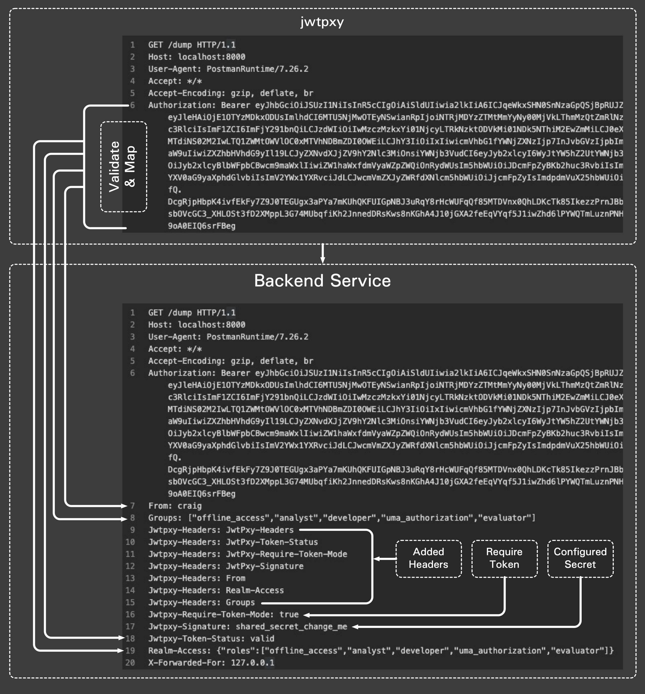

# JSON Web Token Reverse Proxy

`jwtpxy` simplifies API security by pre-validating and parsing JWT web tokens into HTTP headers easily read by backend services.



## Environment Variable Configuration

| Variable         | Default                                             | Description                                                   |
|:-----------------|:----------------------------------------------------|:--------------------------------------------------------------|
| `IP`             | `127.0.0.1`                                         | Server IP address to bind to.                                 |
| `PORT`           | `8080`                                              | Server port.                                                  |
| `UTIL_PORT`      | `8000`                                              | Utility server port.                                          |
| `METRICS_PORT`   | `2112`                                              | Metrics port.                                                 |
| `READ_TIMEOUT`   | `10`                                                | HTTP read timeout                                             |
| `WRITE_TIMEOUT`  | `10`                                                | HTTP write timeout                                            |
| `DEBUG`          | `false`                                             | Debug log level                                               |
| `KEYCLOAK`       | `http://localhost:8090/auth/realms/master`          | Keycloak realm info                                           |
| `BACKEND`        | `http://localhost:8000`                             | Backend service                                               |
| `HEADER_MAPPING` | `From:preferred_username,Realm-Access:realm_access` | Mapping HTTPS headers to token attributes.                    |
| `REQUIRE_TOKEN`  | `true`                                              | set to string "false" to allow un-authenticated pass-through. |
| `SIG_HEADER`     | `shared_secret_change_me`                           | Signature header / shared secret                              |

## Test

Start Keycloak
```shell script
docker-compose up -d
```

Test Call
```shell script
# install jq if you don't have it
brew install jq

# start jwtpxy
go run ./cmd/jwtpxy.go 

# retrieve an access token
export TOKEN=$(curl -X POST "http://localhost:8090/auth/realms/master/protocol/openid-connect/token" \
 -H "Content-Type: application/x-www-form-urlencoded" \
 -d "username=sysop" \
 -d "password=password" \
 -d 'grant_type=password' \
 -d 'client_id=admin-cli' | jq -r '.access_token')
 
# call the jwtpxy with the default utility backend
curl -L -X GET 'http://localhost:8080/' -H "Authorization: Bearer ${TOKEN}"
```

Sample utility server output (for debugging):

```json
{
  "http_header": {
    "Accept": [
      "*/*"
    ],
    "Accept-Encoding": [
      "gzip, deflate, br"
    ],
    "Access": [
      "This is a test"
    ],
    "Authorization": [
      "Bearer eyJhbGciOiJSUzI1NiIsInR5cCIgOiAiSldUIiwia2lkIiA6ICJqeWkxSHN0SnNzaGpQSjBpRUJZTzgwWlJUNWNPdzV2MnNRcUNmZnJGR1B3In0.eyJleHAiOjE1OTYyNTYzMzcsImlhdCI6MTU5NjI1NjI3NywianRpIjoiNzdkYTk2YTItYWEwNi00ZjAzLTk2NzktOTBlYzI2ZmZmMzhmIiwiaXNzIjoiaHR0cDovL2xvY2FsaG9zdDo4MDkwL2F1dGgvcmVhbG1zL21hc3RlciIsImF1ZCI6ImFjY291bnQiLCJzdWIiOiIwMzczMzkxYi01NjcyLTRkNzktODVkMi01NDk5NThiM2EwZmMiLCJ0eXAiOiJCZWFyZXIiLCJhenAiOiJ0ZXN0X2NsaWVudCIsInNlc3Npb25fc3RhdGUiOiI5MzYxZjY4Mi1iMDZiLTQxNWMtOGY3Zi1mYjI0MmFiMDAyZTIiLCJhY3IiOiIxIiwicmVhbG1fYWNjZXNzIjp7InJvbGVzIjpbIm9mZmxpbmVfYWNjZXNzIiwiYW5hbHlzdCIsImRldmVsb3BlciIsInVtYV9hdXRob3JpemF0aW9uIiwiZXZhbHVhdG9yIl19LCJyZXNvdXJjZV9hY2Nlc3MiOnsiYWNjb3VudCI6eyJyb2xlcyI6WyJtYW5hZ2UtYWNjb3VudCIsIm1hbmFnZS1hY2NvdW50LWxpbmtzIiwidmlldy1wcm9maWxlIl19fSwic2NvcGUiOiJyb2xlcyBlbWFpbCBwcm9maWxlIiwiZW1haWxfdmVyaWZpZWQiOnRydWUsIm5hbWUiOiJDcmFpZyBKb2huc3RvbiIsImdyb3VwcyI6WyJvZmZsaW5lX2FjY2VzcyIsImFuYWx5c3QiLCJkZXZlbG9wZXIiLCJ1bWFfYXV0aG9yaXphdGlvbiIsImV2YWx1YXRvciJdLCJwcmVmZXJyZWRfdXNlcm5hbWUiOiJjcmFpZyIsImdpdmVuX25hbWUiOiJDcmFpZyIsImZhbWlseV9uYW1lIjoiSm9obnN0b24iLCJlbWFpbCI6ImNqQGltdGkuY28ifQ.QXkZ9Y86opTXaT0olHyyNQOs8hnsllJZO0yPWFb8Gnda-tpOi9qvugilgqkO77rzN3BH1x8rFRQbeuhr0_b4kcH3P9VOZrgoTH_B7dweLh4Q8f8rc7sYcaI-F69sVEc0B3TLZHtKBfOvAVpJvB2QlUqk-O4Mj_isgpIE9Q46pvQ8oIcdVj3-MrSTIxgosCW-WGn9E6KCHIMBUJB47oUUdxtt95wMI5lgSEJN45k5Ie2znR36smogzcNZmey2wTHfzVpO7DgLL4wKgD6cjKNiPF_tydA6mV9wqqvrLqV73wdCs1a_-on_HKbQmDNawQXnZvvhW23CSZsr3_sAhWzImg"
    ],
    "From": [
      "craig"
    ],
    "Groups": [
      "[\"offline_access\",\"analyst\",\"developer\",\"uma_authorization\",\"evaluator\"]"
    ],
    "Jwtpxy-Headers": [
      "JwtPxy-Headers",
      "JwtPxy-Token-Status",
      "JwtPxy-Require-Token-Mode",
      "JwtPxy-Signature",
      "From",
      "Realm-Access",
      "Groups"
    ],
    "Jwtpxy-Require-Token-Mode": [
      "true"
    ],
    "Jwtpxy-Signature": [
      "shared_secret"
    ],
    "Jwtpxy-Token-Status": [
      "valid"
    ],
    "Realm-Access": [
      "{\"roles\":[\"offline_access\",\"analyst\",\"developer\",\"uma_authorization\",\"evaluator\"]}"
    ],
    "User-Agent": [
      "PostmanRuntime/7.26.2"
    ],
    "X-Forwarded-For": [
      "127.0.0.1"
    ]
  },
  "token": {
    "header": {
      "alg": "RS256",
      "kid": "jyi1HstJsshjPJ0iEBYO80ZRT5cOw5v2sQqCffrFGPw",
      "typ": "JWT"
    },
    "data": {
      "acr": "1",
      "aud": "account",
      "azp": "test_client",
      "email": "cj@imti.co",
      "email_verified": true,
      "exp": 1596256337,
      "family_name": "Johnston",
      "given_name": "Craig",
      "groups": [
        "offline_access",
        "analyst",
        "developer",
        "uma_authorization",
        "evaluator"
      ],
      "iat": 1596256277,
      "iss": "http://localhost:8090/auth/realms/master",
      "jti": "77da96a2-aa06-4f03-9679-90ec26fff38f",
      "name": "Craig Johnston",
      "preferred_username": "craig",
      "realm_access": {
        "roles": [
          "offline_access",
          "analyst",
          "developer",
          "uma_authorization",
          "evaluator"
        ]
      },
      "resource_access": {
        "account": {
          "roles": [
            "manage-account",
            "manage-account-links",
            "view-profile"
          ]
        }
      },
      "scope": "roles email profile",
      "session_state": "9361f682-b06b-415c-8f7f-fb242ab002e2",
      "sub": "0373391b-5672-4d79-85d2-549958b3a0fc",
      "typ": "Bearer"
    },
    "signature": "QXkZ9Y86opTXaT0olHyyNQOs8hnsllJZO0yPWFb8Gnda-tpOi9qvugilgqkO77rzN3BH1x8rFRQbeuhr0_b4kcH3P9VOZrgoTH_B7dweLh4Q8f8rc7sYcaI-F69sVEc0B3TLZHtKBfOvAVpJvB2QlUqk-O4Mj_isgpIE9Q46pvQ8oIcdVj3-MrSTIxgosCW-WGn9E6KCHIMBUJB47oUUdxtt95wMI5lgSEJN45k5Ie2znR36smogzcNZmey2wTHfzVpO7DgLL4wKgD6cjKNiPF_tydA6mV9wqqvrLqV73wdCs1a_-on_HKbQmDNawQXnZvvhW23CSZsr3_sAhWzImg"
  }
}
```

Cleanup
```shell script
docker-compose stop && docker-compose rm
```

## Development

### Test Release

```bash
goreleaser --skip-publish --rm-dist --skip-validate
```

### Release

```bash
GITHUB_TOKEN=$GITHUB_TOKEN goreleaser --rm-dist
```
